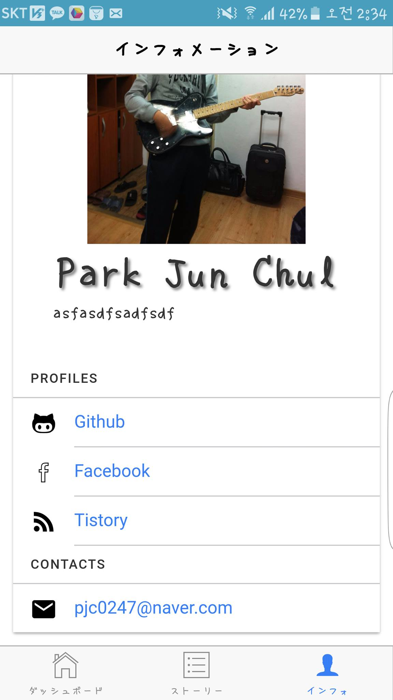

프로필 화면 설정하기
====
이 장에서는 프로필 탭을 클릭하면 나오는 화면을 설정하는 방법에 대해서 설명합니다.<br>
In this section, we'll learn how to set up a profile page. 



기본 정보 작성하기
----
화면에 보여지는 이름, 이메일 등의 기본적인 정보 작성 방법에 대해서는 [Profile 레퍼런스](profile.md)를 참고해 주세요.<br>
To configure basic information(name, email, etc...) of your personal profile,  Please refer to the '[REF: Profile](profile.md)' page.

프로필 사진 지정하기
----
기본적으로 표시되는 프로필 사진은 아래 경로에 위치하여 있습니다. 아래 경로에 새로운 프로필 사진을 덮어 씌우면 프로필 사진이 변경됩니다.<br>
Basically, the profile image is located under the path below. You can change the image by replacing the file.

```
www/img/profile/me.jpg
```  

See Also
----
* [REF: Profile](profile.md)
