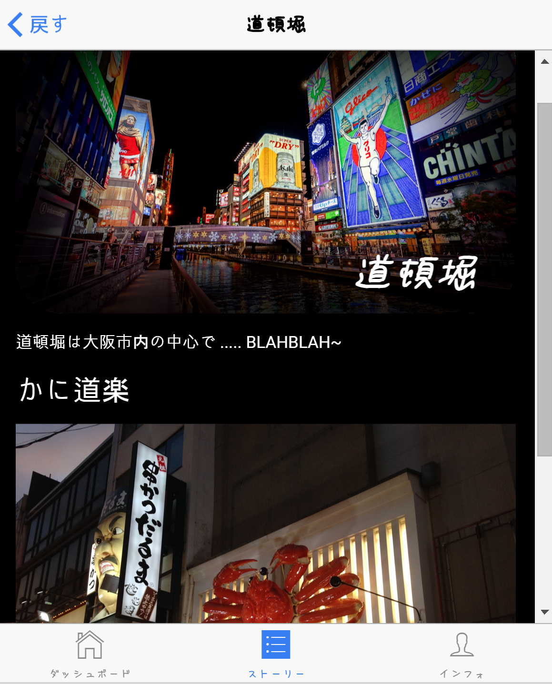

상세보기 화면 작성하기
====

이 장에서는 스토리의 상세 보기 화면에서 어떻게 스타일을 지정하고, 글을 작성하는지의 방법에 대하여 다룹니다.  

내용 작성하기
----
스토리의 내용은 __MarkDown__ 형식에 맞게 작성합니다.
 
자세한 내용은 마크다운 가이드를 참조해 주세요.
 
ストリーの内容は__MarkDown__のルールで作成して下さい。 
詳しくはマークダウンガイドを参考して下さい。

헤더 이미지
----
각각의 상세보기 화면에는 헤더 이미지를 설정할 수 있습니다.

