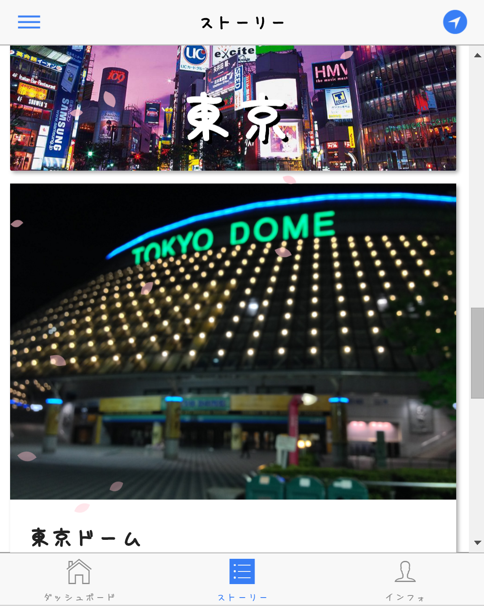
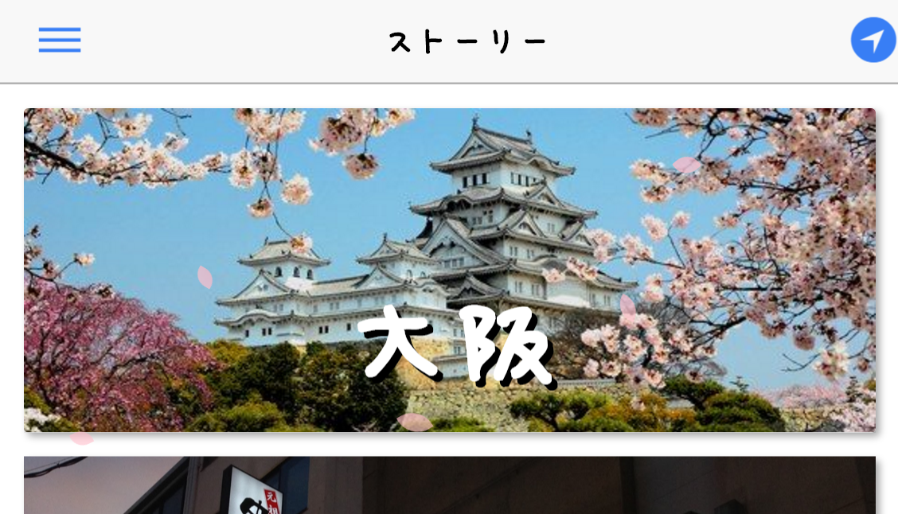
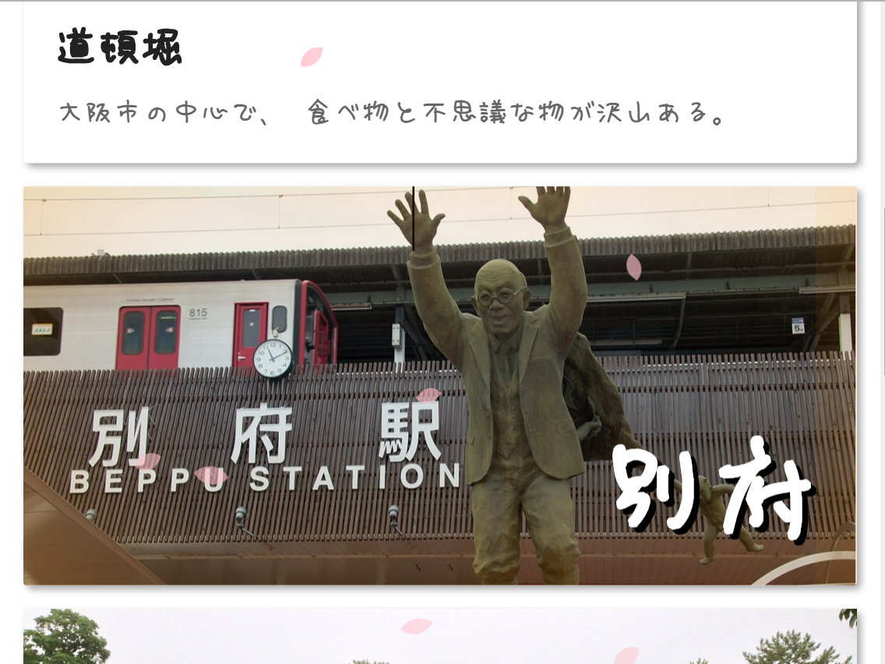
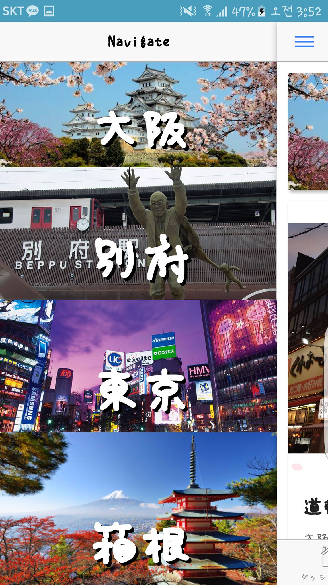

썸네일 영역 작성하기
====



앱의 두번째 탭인 썸네일 화면을 설정하는 방법에 대해 설명합니다.<br>
In this section, we'll learn how to configure the thumbnail list page.

인덱스 파일 생성하기
----
썸네일 페이지의 카드 목록은 수동으로 생성되는 인덱스 파일에 의해 렌더링됩니다.
<br>
인덱스 파일은 아래와 같은 id들의 목록입니다. 이 파일은 아래 경로에 위치합니다.
```
www/story/index.json
```
```json
[
    ":tokyo",
        "tokyodome",
        "gorakuen",
        "akihabara",
    ":osaka",
        "osaka_castle",
        "sinsekai",
    ":beppu",
        "jigokumeguri"
]
```

대단위 지역([RegionHeader](region_header.md))을 나타낼 경우 id 앞에 콜론(`:`)을 추가합니다.<br>
콜론을 추가하게 되면 자동으로 지역으로 인식됩니다.<br>
The id which starts with a colon(`:`) will be automatically treated as a RegionHeader.


지역 헤더 꾸미기
----
기본적으로 지역 헤더는 아래와 같이 표시되지만 json 파일을 수정하여 다양한 옵션을 추가할 수 있습니다.



#### __타이틀 위치 변경하기__
기본적으로 타이틀은 중간 아래에 위치하지만 배경에 따라서 해당 위치는 적합하지 않을 수 있습니다.
그럴 경우에 타이틀이 표시되는 위치를 변경해 이미지와 어울리도록 할 수 있습니다.
<br>
As a default, title text will be displayed on the center bottom position. But you can change this position as you want to.


```json
{
    "offsetX" : "100px",
    "offsetY" : "100px"
}
```
각각의 속성은 옵션이므로 X 또는 Y 위치 둘중에 하나만 지정할 수도 있습니다<br>
Each attributes are optional. You can specify a single value 'X' or 'Y'.

#### __페이딩 효과 추가하기__


```json
{
    "fadeDistance" : "100px",
    "fadeSpread" : "100px",
    "fadeColor" : "red"
}
```

#### __라운드 엣지 적용하기__


```json
{
    "radius" : "10px"
}
```

#### __타이틀 색 변경하기__


```json
{
    "titleColor" : "red"
}
```

더 많은 옵션은 [RegionHeader 레퍼런스](region_header.md)를 참조해 주세요.
<br>
일부 옵션은 네비게이터에서 적용되지 않을 수 있습니다.
<br>
To change further more options, Please refer to the '(REF: RegionHeader)' page.<br>
Note that some options are not affected in the Navigator menu.


네비게이터
----



SeeAlso
----
* [REF: RegionHeader](region_header.md)
* [REF: StoryThumbnail](story_thumbnail.md)
